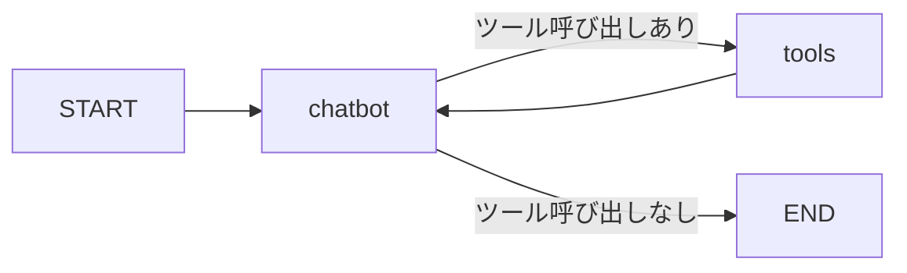

# LangGraph ハンズオン

LangGraphを段階的に学ぶためのハンズオン教材です。基本的なLLM呼び出しから、ツール呼び出し、会話履歴の保存、Human-in-the-loopまでを学びます。

## セットアップ

### 必要環境
- Python 3.9以上

### インストール

```bash
pip3 install -r requirements.txt
```

または個別にインストール:

```bash
pip3 install langchain-google-genai langgraph langchain-core
```

### APIキーの設定

`common/llm.py` にGoogle AI APIキーを設定してください。

---

## チャプター構成

| Chapter | テーマ | 学習内容 |
|---------|--------|----------|
| 1 | 基本 | 環境確認、LLM呼び出し |
| 2 | グラフ基礎 | State, Node, Edgeの基本 |
| 3 | ツール | ツール呼び出し、複数ツール、可視化 |
| 4 | メモリ | 会話履歴の保存 |
| 5 | 承認フロー | Human-in-the-loop |

---

## Chapter 1: 基本

```bash
python3 chapter1/hello_gemini.py
```

Gemini APIを呼び出して応答を取得する最もシンプルな例です。環境確認も兼ねています。

---

## Chapter 2: シンプルなチャットボット

```bash
python3 chapter2/simple_chat.py
```

LangGraphの基本構造を学びます:
- **State**: グラフ全体で共有されるデータ
- **Node**: 処理単位（関数）
- **Edge**: ノード間の遷移


---

## Chapter 3: ツール呼び出し

### 3-1. 単一ツール
```bash
python3 chapter3/multiply_tool.py
```

LLMが自動的にツール（関数）を呼び出すパターンを学びます。



### 3-2. 複数ツールエージェント
```bash
python3 chapter3/multi_tools.py
```

複数のツール（計算、天気検索、時刻取得など）を定義し、LLMが状況に応じて適切なツールを選択する仕組みを学びます。

### 3-3. グラフの可視化
```bash
python3 chapter3/visualize_graph.py
```

`graph.get_graph().draw_mermaid()`でグラフ構造をMermaid記法で出力します。

出力されたコードは以下で可視化できます:
- https://mermaid.live/
- GitHubのMarkdown（```mermaid ブロック）
- VSCode Mermaid拡張機能

---

## Chapter 4: 会話履歴の保存

```bash
python3 chapter4/memory_saver.py
```

`MemorySaver`を使って、複数ターンの会話で文脈を保持します。

---

## Chapter 5: Human-in-the-loop

```bash
python3 chapter5/human_in_loop.py
```

`interrupt_before`を使って、重要な操作（メール送信、ファイル削除など）の前にユーザー承認を求めるパターンを学びます。

実運用で必須のセキュリティパターンです。

入力を求められたら以下の文章を記入してみましょう。

```
会議の予定を調整する本文を考えて作成し、メールを送信して。
```

---

## 演習問題 (Exercises)

穴埋め形式の演習問題で理解を深めましょう。

| Exercise | テーマ | 内容 |
|----------|--------|------|
| 1 | 基本グラフ | 翻訳チャットボットを作成 |
| 2 | ツール定義 | 除算ツールを実装 |
| 3 | メモリ | 名前を覚えるチャットボット |

```bash
# 演習を実行
python3 exercises/exercise1_basic_graph.py
python3 exercises/exercise2_tool_binding.py
python3 exercises/exercise3_memory.py

# 解答を確認
python3 exercises/answers/answer1_basic_graph.py
```

---

## プロジェクト構造

```
langgraph-hands-on/
├── README.md
├── requirements.txt
├── common/
│   ├── __init__.py
│   └── llm.py              # 共有LLMインスタンス
├── chapter1/
│   └── hello_gemini.py     # LLM基本呼び出し
├── chapter2/
│   └── simple_chat.py      # 基本グラフ
├── chapter3/
│   ├── multiply_tool.py    # 単一ツール
│   ├── multi_tools.py      # 複数ツール
│   └── visualize_graph.py  # グラフ可視化
├── chapter4/
│   └── memory_saver.py     # 会話履歴保存
├── chapter5/
│   └── human_in_loop.py    # Human-in-the-loop
└── exercises/
    ├── exercise1_basic_graph.py
    ├── exercise2_tool_binding.py
    ├── exercise3_memory.py
    └── answers/
        ├── answer1_basic_graph.py
        ├── answer2_tool_binding.py
        └── answer3_memory.py
```

---

## LangGraphの主要概念

| 概念 | 説明 |
|------|------|
| **State** | グラフ全体で共有される状態（TypedDict） |
| **Node** | 計算単位となる関数 |
| **Edge** | ノード間の無条件遷移 |
| **Conditional Edge** | 条件に応じた動的な遷移 |
| **Checkpointer** | 実行状態の保存と復元 |
| **Tool** | LLMが呼び出せる外部関数 |
| **interrupt_before** | 指定ノードの前で一時停止 |

---

## 参考リンク

- [LangGraph公式ドキュメント](https://langchain-ai.github.io/langgraph/)
- [LangChain公式ドキュメント](https://python.langchain.com/)
