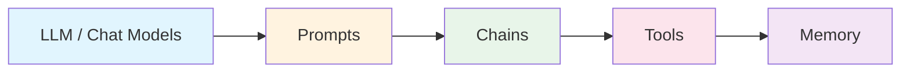
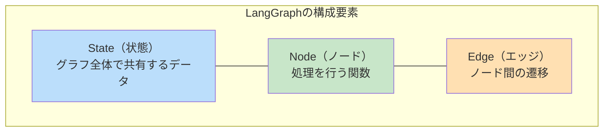
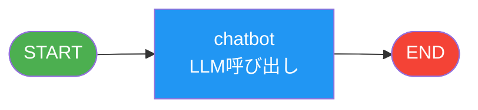
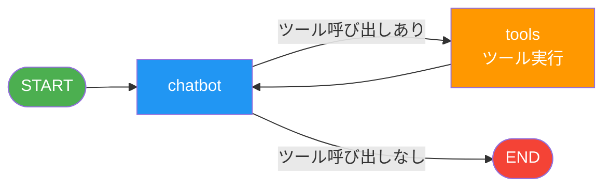
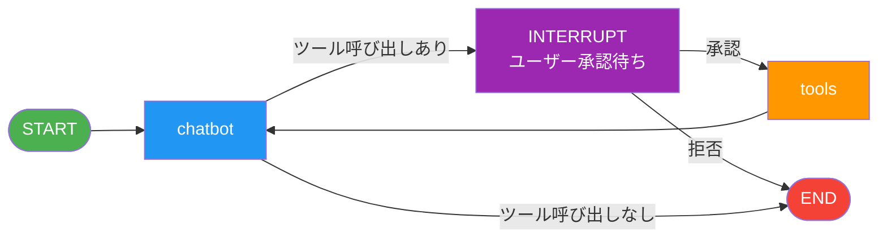
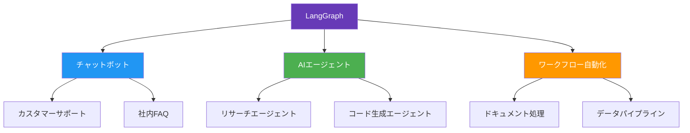

# LangChain / LangGraph 入門

**対象者**: エンジニア経験あり、LLM初学者
**所要時間**: 約10分

---

## 1. なぜフレームワークが必要か

### LLM単体呼び出しの限界

```
ユーザー → LLM API → 応答
```

**課題**:
- 状態管理がない（会話履歴を自分で管理）
- 複雑なフローが書きにくい（条件分岐、ループ）
- 外部ツールとの連携が煩雑

**解決策**: LangChain / LangGraph を使う

---

## 2. LangChainとは

> **LLMアプリ開発の共通部品を提供するフレームワーク**

### 主要コンポーネント



| コンポーネント | 役割 |
|----------------|------|
| **LLM / Chat Models** | 各社のLLMを統一インターフェースで利用 |
| **Prompts** | プロンプトのテンプレート化・管理 |
| **Chains** | 複数の処理をつなげる |
| **Tools** | 外部API・関数をLLMから呼び出す |
| **Memory** | 会話履歴の管理 |

---

## 3. LangGraphとは

> **状態を持つマルチステップのAIワークフローを構築するフレームワーク**

- LangChainの上に構築
- **グラフ構造**でフローを定義
- 複雑なエージェントの構築に最適

---

## 4. LangGraphの3つの基本要素



### 各要素の役割

| 要素 | 説明 | 例 |
|------|------|-----|
| **State** | グラフ全体で共有するデータ | メッセージ履歴、ユーザー情報 |
| **Node** | 処理を行う関数 | LLM呼び出し、ツール実行 |
| **Edge** | ノード間の遷移 | 無条件遷移、条件分岐 |

---

## 5. グラフの進化パターン

### Level 1: シンプルなチャット

最も基本的な構造。入力を受けてLLMが応答する。



**特徴**: 1回のやり取りで完結

---

### Level 2: ツール呼び出し（ループ）

LLMが必要に応じて外部ツールを呼び出す。



**特徴**:
- 条件分岐（ツールが必要かどうか）
- ループ構造（ツール実行後にLLMに戻る）

**使用例**: 計算、天気検索、データベース検索

---

### Level 3: Human-in-the-loop

重要な操作の前にユーザーの承認を求める。



**特徴**:
- 危険な操作の前で一時停止
- ユーザーが承認/拒否を選択

**使用例**: メール送信、ファイル削除、課金処理

---

## 6. LangGraphの主要機能まとめ

| 機能 | 説明 | ユースケース |
|------|------|--------------|
| **State** | グラフ全体で共有する状態 | メッセージ履歴の管理 |
| **Node** | 処理を行う関数 | LLM呼び出し、データ変換 |
| **Edge** | ノード間の遷移 | フローの制御 |
| **Conditional Edge** | 条件に応じた分岐 | ツール有無の判定 |
| **Tools** | LLMが呼び出せる外部関数 | 計算、API呼び出し |
| **Memory** | 会話履歴の永続化 | マルチターン会話 |
| **Interrupt** | 指定ノード前で一時停止 | 承認フロー |

---

## 7. LangGraphで作れるもの



---

## 8. 次のステップ: ハンズオン

このリポジトリのハンズオンで実際にコードを書いて学ぼう！

| Chapter | 内容 | 学べること |
|---------|------|------------|
| Chapter 1 | Hello Gemini | LLM基本呼び出し |
| Chapter 2 | Simple Chat | グラフの基礎（State/Node/Edge） |
| Chapter 3 | Tool Calling | ツール呼び出しとループ |
| Chapter 4 | Memory | 会話履歴の保存 |
| Chapter 5 | Human-in-the-loop | ユーザー承認フロー |

```bash
# セットアップ
pip install -r requirements.txt

# Chapter 1 から順に実行
python chapter1/hello_gemini.py
```

---

## 参考リンク

- [LangChain 公式ドキュメント](https://python.langchain.com/)
- [LangGraph 公式ドキュメント](https://langchain-ai.github.io/langgraph/)
- [LangGraph チュートリアル](https://langchain-ai.github.io/langgraph/tutorials/)

---

## Q&A

質問があればどうぞ！
